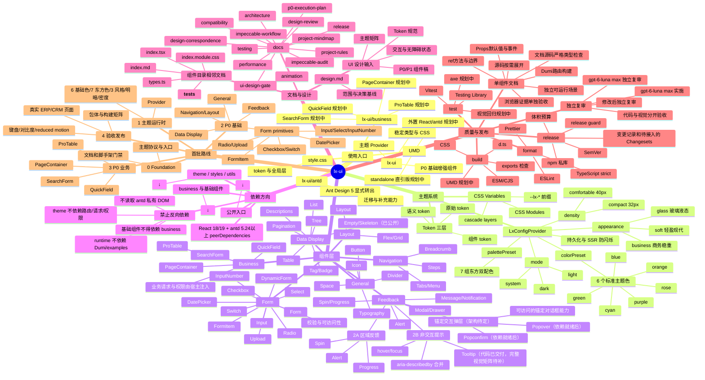

# lx-ui 项目脑图

这张脑图是开发者进入仓库后的总览。它描述公开入口、主题系统、组件分层、文档质量链路和首批交付顺序；组件实现完成后，新增模块仍应先更新这里对应的分支。

## 动态表单在脑图中的位置

`DynamicForm` 是 P0 业务组件，但必须建立在 P0 Form 基础组件之上。它接收字段描述数组和可选的字段注册表，负责布局、联动、校验展示和提交值整理；请求、权限、字典加载和业务 API 由宿主传入。这样可以复用基础字段，同时避免把业务协议写死在组件库里。

旧版 `lxComponent` 的 `quick-field`、虚拟表格、树形部门选择和组件相邻文档会作为经验输入；旧版 AntD4/Less/业务请求耦合不进入 lx-ui 运行时。

建议首版字段描述至少覆盖 `text`、`textarea`、`number`、`select`、`date`、`dateRange`、`checkbox`、`radio`、`switch`、`upload` 和自定义 `render`。进入编码前仍需确认异步选项、字段联动、数组字段、分组/步骤、默认值和错误回填协议。

## 设计稿与代码的关系

`UI/` 下的 `DESIGN.md`、`screen.png` 和 `code.html` 是 Stitch 设计输入与评审证据，不是 npm 运行时代码。实现时只提取已确认的 token、状态和交互规则，不能直接把 Tailwind CDN、Google Fonts 或设计稿脚本带入组件产物。
