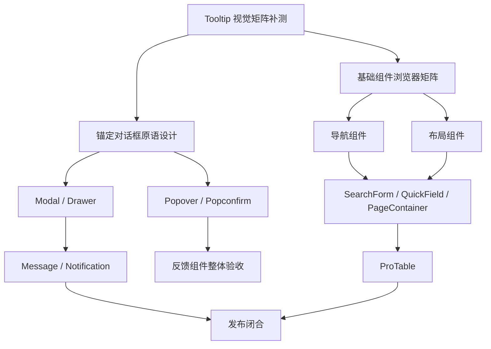

# lx-ui 后续实施总计划

更新时间：2026-10-06
适用范围：React 18/19、Ant Design 5、PC 中后台组件库  
维护人：主代理负责架构、边界、验收和交付；子代理负责在明确边界内实现与复审

这份文档是 Tooltip 之后的执行计划。它把已经存在的代码、尚未完成的浏览器证据和待实现模块排成有依赖关系的批次。每个批次必须关闭自己的问题后才能进入下一批；“代码已经存在”不等于“组件已经交付”。

## 一、当前基线

### 已完成的能力

- 主题运行时：`LxConfigProvider`、light/dark/system、comfortable/compact、business/soft/glass、6 个标准主题色和 7 组东方配色。
- General：Button、Icon、Typography、Space、Divider。
- Form：Input、InputNumber、Select、DatePicker、Checkbox、Switch、Radio、Upload、FormItem、DynamicForm。
- Data Display：Pagination、Table、Tree、Empty、Skeleton、Result、Tag、Badge、Descriptions、Avatar、Statistic、Card、List。
- Feedback：Alert、Spin、Progress、Tooltip。
- 文档体系：Dumi 组件页、独立 demo、API 表、行为边界、中文注释、项目规则和 Impeccable 审计记录。
- 工程出口：主入口、`lx-ui/antd`、`lx-ui/business`、`lx-ui/theme` 和 CSS 入口；AntD 5 作为 peer dependency。

### 当前未闭合项

1. 已实现组件的完整浏览器矩阵还未全部完成。Tooltip 已验证 930/390/360/320px、ARIA 合并/恢复、受控触发、12 个方位、左右边缘翻转、窄屏 API 表键盘滚动和一个 dark/compact/glass 主题组合；200%/400% 缩放、系统级 reduced-motion、屏幕阅读器、全主题矩阵和 React 19 消费 smoke 仍需补证据。
2. Popover 和 Popconfirm 暂不实现。它们需要先有可访问的锚定对话框原语，不能把 Tooltip 的 `role="tooltip"` 语义扩展到可操作内容。
3. Modal、Drawer、Message、Notification 尚未实现。
4. Breadcrumb、Steps、Tabs、Dropdown/Menu 尚未实现。
5. Layout、Flex、Grid 尚未实现。
6. SearchForm、QuickField、PageContainer、ProTable 尚未实现。
7. React 19、UMD、直引脚本、私库发布和独立包体报告尚未闭合。
8. Dumi 文档站冷加载资源较重：2026-10-09 Button 路由本地测得 13 个 JS 共 1,308,345 B gzip 模拟内容（5,030,774 B 解码）；目标部署压缩与 Core Web Vitals 未测。先分析 `7953` 共享 chunk、组件 metadata 与当前路由 demo 的依赖和加载方式，再确定预算并在隔离构建中验证拆分收益；不将 npm 单组件预算套用于文档站。

## 二、依赖关系和批次顺序

执行顺序固定为：

1. 2B-1 Tooltip 浏览器验收收口。
2. 2B-2 锚定对话框原语设计与最小实现。
3. 2B-3 Popover、Popconfirm、Modal、Drawer、Message、Notification。
4. 3A 导航基础组件。
5. 4A 布局基础组件。
6. 5A 业务组合组件。
7. 5B ProTable。
8. 6A React 18/19、SSR、UMD、包体和发布闭合。

## 三、详细执行批次

### 批次 2B-1：现有组件浏览器验收收口

目标是把已实现组件从“静态代码 GO”推进到“有范围说明的浏览器交付”。不新增组件 API。

工作项：

- 建立浏览器矩阵表：默认桌面、930px、390px、320px、200% 缩放、light/dark、comfortable/compact、business/soft/glass、代表性标准色和东方配色。
- 为每个组件选择最小状态路径：默认、hover、focus、disabled、loading、empty、error、恢复、长文本和 portal 容器。
- 优先处理 Tooltip、Input、DynamicForm、Table、Upload、Alert、Spin、Progress；其余组件按 Data Display、Form、General 顺序抽查。
- 记录真实视口、操作、DOM/AX 结果、控制台、截图和未覆盖范围；浏览器工具受限时保留真实限制。
- 检查实际包体和 demo 是否被错误打入 npm 产物。

关闭条件：

- 每个已公开组件都有一条可追溯的浏览器证据或明确的未验收记录。
- 不把 `detect` 的 `[]`、单元测试或源码阅读写成视觉通过。
- P0/P1 关闭；P2 要么修复，要么写入后续计划并说明影响。

### 批次 2B-2：可访问的锚定对话框原语

这是 Popover/Popconfirm 的前置架构批次，先评审协议再写组件。

必须先锁定：

- 公开 DOM 契约：锚点、浮层根、`role`、`aria-expanded`、`aria-controls`、`aria-describedby` 的职责边界。
- 焦点进入、焦点恢复、Tab 循环、Escape 关闭、外部点击、失焦策略和嵌套浮层规则。
- 非模态锚定面与模态 dialog 的差异，禁止用 `role="tooltip"` 冒充交互对话框。
- SSR/hydration、StrictMode、多实例、portal 容器、滚动裁切、边缘定位和异步内容生命周期。
- AntD 公共 API 与自有原语的责任边界；禁止查询 AntD 私有 DOM，禁止运行时改写原生角色。

关闭条件：

- ADR、TypeScript 类型、键盘行为测试、SSR 测试、焦点恢复测试和定位 demo 通过独立复审。
- 在原语未关闭前，Popover/Popconfirm 不进入 scaffold 白名单和主包出口。

### 批次 2B-3：反馈组件完善

实施顺序：Modal → Drawer → Popover → Popconfirm → Message → Notification。

每个组件必须明确：

- 受控和非受控状态，打开/关闭回调，卸载时是否保留内容。
- loading、失败、异步确认、重复提交、关闭阻止和错误恢复。
- 焦点陷阱或焦点恢复规则，Esc、遮罩点击和浏览器返回键是否由宿主处理。
- portal、z-index、多个 Provider、嵌套弹层和窄屏布局。
- 不把请求、权限、路由、全局消息队列和业务缓存写入基础组件。

关闭条件：组件目录契约、中文注释、公开类型、可运行 demo、行为测试、SSR/StrictMode 测试、浏览器交互证据、构建和包体检查全部通过。

### 批次 3A：导航组件

实施顺序：Breadcrumb → Steps → Tabs → Dropdown/Menu。

协议重点：

- 路由只由宿主通过 `href`、链接组件或回调注入；组件不读取路由和 URL。
- Tabs 的受控 key、默认 key、键盘箭头/Home/End、删除和溢出策略。
- Menu 的层级 key、展开状态、点击外部、Escape、方向键和长标题。
- Dropdown 只负责锚定和菜单呈现，菜单项动作由宿主提供。

### 批次 4A：布局组件

实施顺序：Flex/Grid → Layout。

协议重点：

- Flex/Grid 消费主题间距和断点 token，不创建第二套栅格系统。
- Layout 的 Header/Sider/Content/Footer 只管理结构；权限、路由、菜单数据由宿主传入。
- Sider 折叠状态受控，移动端断点和 SSR 初始布局必须明确。
- 验收覆盖 320px、200%/400% 缩放、长标题、sticky、滚动容器和焦点可见。

### 批次 5A：业务组合组件

实施顺序：SearchForm → QuickField → PageContainer。

- SearchForm 将草稿值和已提交查询值分开，IME 回车、重置、异步失败和 URL adapter 由公开协议描述。
- QuickField 将展示、编辑、保存中、成功、失败、重试和取消建模为状态机，不内置请求。
- PageContainer 只提供标题、面包屑、操作区和内容槽，不拥有权限、路由或页面请求。
- 每个组合组件必须基于已完成的基础组件，禁止重新实现 Input、FormItem、Button 等视觉控件。

### 批次 5B：ProTable

在 SearchForm、Pagination、Table、Layout 稳定后实现。

必须先锁定：

- `dataSource` 与 `request` 的互斥关系。
- AbortSignal/requestId 取消旧请求，旧响应不能覆盖新查询。
- 总数变化时的页码修正、跨页选择策略、列配置持久化由宿主注入。
- 筛选、排序、分页、批量操作、失败重试、空状态和权限占位。
- 虚拟化为显式能力，不默认打开；固定列和横向滚动必须有真实浏览器证据。

### 批次 6A：发布闭合

- React 18 和 React 19 消费 smoke，至少覆盖主入口、`lx-ui/antd`、`lx-ui/theme`、CSS 入口和业务入口。
- SSR renderToString/hydration、StrictMode、按需引入和重复依赖检查。
- 设计统一国际化协议；Tag 当前默认关闭名称为中文，非中文宿主需逐项传入 `closable['aria-label']`，在开放多语言发布前评估 Provider 级默认名称及多语言读屏验证。
- ESM/CJS 类型声明、UMD 外置 peer、standalone 直引版本和 gzip/unpacked 包体报告。
- `npm pack --dry-run` 确认不含 demos、tests、Dumi 临时文件和 UI 设计输入。
- 私库 registry、版本、CHANGELOG、迁移说明和发布前 `private` 状态评审。

## 四、每批固定执行模板

### 开始前

1. 读取 `AGENTS.md`、`docs/project-rules.md`、`docs/impeccable-workflow.md`、本批设计稿和相邻组件。
2. 列出公开 API、状态机、键盘/读屏语义、依赖和包体预算。
3. 更新本文件对应任务状态；没有设计证据的状态先记为待决策。

### 实现中

1. 主代理先锁协议，`gpt-6.1-sol` medium 子代理在明确边界内实现代码；关键逻辑使用 high。
2. 所有注释和 JSDoc 使用中文；组件目录必须有 `index.tsx`、`index.module.css`、`index.md`、`types.ts` 和测试。
3. 每个 demo 必须可运行，展示样式、使用方法、Props、事件、ref、边界和恢复路径。
4. 运行 Impeccable context、audit、critique、polish；`detect []` 只作机械记录。

### 交付前

1. `gpt-6.1-sol` high 独立 code review；UX 与证据分别由 medium 隔离代理审查。
2. P0/P1/P2 修复后再次使用 `gpt-6.1-sol` high 复审；模型服务失败要记录，不能虚构结论。
3. 自动格式化本批文件，再运行 scaffold、format、typecheck、demo typecheck、lint、test、lib build、docs build 和包体检查。
4. 主代理检查 diff、审计记录、未覆盖范围和公开出口。
5. 提交 Conventional Commit 并普通 push；禁止强推和混入无关改动。

## 五、风险与决策闸门

| 风险               | 触发条件                           | 处理方式                                   |
| ------------------ | ---------------------------------- | ------------------------------------------ |
| 视觉稿只有静态画面 | 缺少焦点、错误、窄屏或动效状态     | 先补设计评审和状态表，不自行扩展公开 API   |
| AntD 公共 API 不足 | 需要查询私有 DOM 或 rc-* 实例      | 停止实现，建立自有原语或调整范围           |
| 包体增长           | 新依赖、整包图标、重复 AntD        | 先做体积对比和替代方案评估                 |
| 受控状态歧义       | open/value 与 default 同时变化     | 写优先级、测试动态切换，并优先禁止隐式切换 |
| 浏览器能力受限     | 无法设置视口或读取屏幕阅读器       | 记录真实限制，不把静态证据写成视觉通过     |
| 业务边界膨胀       | 组件开始处理请求、权限、路由、缓存 | 抽成宿主 adapter 或 business 组合组件      |

## 六、当前下一步

**批次 2B-1 仍在进行，详细状态以 [browser-acceptance-matrix.md](./browser-acceptance-matrix.md) 为准。** 全部 32 个公开组件路由已有 Chromium/Edge 根溢出 smoke；非 DynamicForm 路由主题矩阵为两浏览器各 31/31，DynamicForm 独立矩阵为各 1/1；Table 基础滚动、固定列、虚拟化、详情和主题/密度已有分项浏览器证据。Upload 宿主示例已通过 Chromium 8/8，验证浏览器 multipart mock 请求和失败/删除恢复；真实生产服务端、认证授权和实际系统文件选择器取消仍待验收。Table 纯文本格方向键不作为当前默认组件的 P2 待修项，已按 [ADR-0005](./adr/0005-table-keyboard-model.md) 接受原生静态表格语义；该选择不等于单元格网格导航或真实读屏通过。仍待完成的重点包括真实屏幕阅读器、真实 200%/400% page zoom、Safari 实机/版本覆盖、实体触控、目标部署和设备性能。**批次 2B-2 的 ADR-0004 架构决策已接受，但其实现仍受 2B-1 关闭条件约束**；在门槛满足前不加入浮层依赖、不实现锚定原语、不公开 Popover/Popconfirm。所有浏览器能力限制和逐组件未验收项都以实际证据记录，不从源码推断通过。

2026-10-05 续验：DynamicForm 级联与提交恢复已在 `http://localhost:8001/components/form/dynamic-form` 实际演示。已验证选择“西湖区”后改为“华南”会清空城市/区县、禁用区县并播报清理结果；重置回到“华东”。完整客户录入首次提交失败保留值、错误和重试同屏、焦点返回重试按钮；重试成功后聚焦“查看客户”，继续新增清空并聚焦客户名称。页面主题、级联值、客户输入、失败模拟选项均已恢复。DynamicForm 的宽度与主题局部证据不关闭全库 2B-1 矩阵；其他组件的键盘、主题、缩放、读屏和跨浏览器缺口仍按 `browser-acceptance-matrix.md` 继续处理。

2026-10-06 续验：Table 在 1280/930/390/320px、light/dark、comfortable/compact 共 16 组下复验；自动化记录的交互表示例表头均为 36px，基础示例表头在截图中目测为 36px、未单独写入矩阵 JSON。390px 页面根无横向溢出，独立 UX 评审报告的 48px 表头在当前复验未复现。排序、选择/筛选、详情焦点、空/错/加载恢复和键盘横向滚动已有局部浏览器证据；固定列宿主、虚拟化性能、缩放、读屏、Safari/Edge 和全色板仍未验收。文档壳的页头提示与页脚对比度已用当前 light/dark 计算样式复量并达到 AA。移动端搜索入口已由提交 `80a4ee0` 实现；本段早先“入口不可用”的状态由后续提交更新，不代表已通过浏览器验证。搜索清除入口、窄屏结果区分度及该入口的键盘、触控、读屏、明暗实测仍待处理；Table 及全库 2B-1 仍未关闭。

2026-10-06 Table 固定列与虚拟化 demo 收口：新增宿主固定列和 1000 行虚拟化两个可运行示例及相邻文档说明。固定列以 `ResizeObserver` 按 422px 内容宽度启停；桌面两端在横向滚动中保持固定，320/390px 关闭固定后采购员操作可用 Tab 自动滚入并真实命中点击。窄屏另测 421/422px 边界。独立 A 组 Chromium 评审 Nielsen 为 33/40，发现固定 demo 审批状态应与主表 Tag 视觉统一；已改用公开 `lx-ui` Tag，并增加“待审/已审”可见断言。最终 8000 实时 Dumi 路由 Chromium 用例 2/2 通过，状态标签在 120px 列内完整显示。虚拟表 1000 行首末 DOM 为 9/8 行，末行位于 360px 容器内且页面 scrollTop 不变。初次即时 viewport 读取曾捕获布局未提交值，浏览器 helper 改为等待 `expect.poll` 的稳定值，仍对持续溢出严格失败。A/B 与 code review 局部结论 GO；这不代表 Table 完整主题、读屏、缩放或跨浏览器矩阵通过，2B-1 继续进行。

2026-10-06 2B-2 架构评审：独立 `gpt-6-luna max` 复核建议使用 `@floating-ui/react` 的公开能力实现内部锚定定位与焦点管理，并由 lx-ui 私有、按 Document 注册的协调器统一 Tooltip 与交互 dialog 的 Escape/topmost 行为。决策、ARIA/焦点契约、SSR、依赖代价和验收条件见 [ADR-0004](./adr/0004-anchored-dialog.md)。2B-1 独立关闭审计为 NO-GO：开放的 P1 浏览器证据缺口与历史独立复审失败记录仍需处理。此处只完成架构决策；在 2B-1 关闭前不添加依赖、不实现原语、不导出 Popover/Popconfirm。

2026-10-06 ADR-0004 复审返工：独立审查指出 portal 默认挂到 Document 时不能继承 Provider DOM wrapper 的 CSS 变量，且 Popconfirm 的 `alertdialog` 标注与非模态契约冲突。修订后规定由私有主题作用域 Context 将最近 Provider 的已解析 `--lx-*` 变量及主题标记应用到浮层根，不写入共享容器；普通 Popconfirm 使用非模态 `dialog`，紧急 `alertdialog` 留给具备完整模态焦点与背景隔离契约的后续规格。待独立复审确认这些边界后，2B-2 文档架构项方可关闭；2B-1 NO-GO 仍阻止运行时依赖和组件实现。

2026-10-06 ADR-0004 二次复审返工：独立审查确认主题作用域和 Popconfirm 语义已闭合，但发现 reduced-motion 只有实现承诺、没有对应关闭门槛。已补充正常动效与 `prefers-reduced-motion: reduce` 的自动化及真实浏览器双路径验收，并明确主题作用域 Context 不进入公开 `useLxTheme` 返回值。

2026-10-06 ADR-0004 最终独立复审为 **GO**，此前 P2 全部关闭，2B-2 架构文档批次完成。文档没有改变 2B-1 状态：全库浏览器验收仍为 NO-GO，因此不添加 Floating UI 依赖、不实现锚定原语、不导出 Popover/Popconfirm。本批 `npm run check`（51 文件、412 测试）、`npm run check:scaffold` 与 `npm run build:lib` 通过；未运行 `npm run build:docs`，因为同一工作区同时存在 8000 和 8001 两个 Dumi dev 进程且共用 `.dumi/tmp`，并发构建会产生文件覆盖风险。无浮层实现，本批不声称 Impeccable 视觉验收通过；Portal 主题作用域和动效的真实浏览器验收列入后续 2B-2 实施关闭条件。

2026-10-06 Dumi 移动搜索补丁收尾：独立 `gpt-6-luna max` 代码审查发现关闭弹窗时重复设置相同关键词会取消 200ms 防抖计时器，却因 React 状态未变化而不再排队搜索；已让同值 setter 保留计时器，并新增回归测试。审查另发现补丁升级清单未提 SearchBar、SearchResult、useSiteSearch，现已补齐；修复后二次审查为 **GO**。默认 `npm run check` 首次在高并发负载下出现两个 DynamicForm demo 不稳定失败；该测试文件单独 12/12 通过，明确 Vitest 使用 1–4 worker 后完整 54 个测试文件、438 项通过。测试、watch 和 coverage 命令现统一限制 worker 数，避免高核心数主机造成过量并发。此代码修复不关闭 2B-1：移动搜索仍缺少真实窄屏浏览器、触控、键盘、明暗主题和读屏证据。

最终门禁：`npm run check`、`npm run check:scaffold`、`npm run build:lib`、`npm run build:docs`、`npm pack --dry-run` 和干净 `dumi@2.4.49` 补丁复放均通过；包预览 522 个文件、解包 754,772 bytes，未包含 docs、tests、UI、Dumi 临时产物或 coverage。静态文档站的最大共享脚本为 661.35 KB gzip，属于文档应用资源，不计入 lx-ui npm 包。

2026-10-06 静态导出 HTTP 冒烟：`npm run build:docs` 后用临时通用静态服务器请求 Table、DynamicForm 和三个嵌套 demo URL，页面均为 HTTP 200，初始 CSS/JS 引用均为 HTTP 200。此证据只覆盖构建文件和静态资源路由，不覆盖目标部署配置、浏览器渲染或组件交互；不改变 2B-1 的未关闭状态，详情见 [browser-acceptance-matrix.md](./browser-acceptance-matrix.md)。

2026-10-06 Chromium / Edge 文档站 Smoke：`npm run build:docs` 通过；同一份 `docs-dist` 在 Chromium 与 Microsoft Edge channel 各通过 34 项 Playwright 检查（32 个组件路由、独立 path/name 身份映射及延迟错误排空负测），精确匹配每页 title/H1，并检查真实 Dumi demo、浏览器错误和 8 个重点页的 930/390/320px 根溢出。错误断言等待请求归零且 1 秒静默（最多 15 秒），负测覆盖 1200ms 后到达的 HTTP 404 和失败请求。Dumi 使用 `favicons: ['/logo.svg']` 后浏览器不再报告 `/favicon.ico` 404；静态资源前缀固定根路径，子路径部署未覆盖。该 Smoke 不验证各组件完整交互、键盘/读屏、主题、缩放或视觉矩阵，不改变 2B-1 的 NO-GO/未关闭状态；详情见 [browser-acceptance-matrix.md](./browser-acceptance-matrix.md)。

2026-10-06 Dumi 移动搜索焦点复验：`mobile-search.test.tsx` 11/11 通过，Playwright Chromium/Edge 搜索用例 6/6 通过；覆盖 320/390px、IME Escape、第一次 Escape 留焦点、第二次 Escape 失焦、快捷键重开和三行摘要。后续候选数量复验将长列表高度收至 320px，并在 320×740、390×844、390×450 验证首屏分别显示 3、4、4 项且可在内部滚动；折叠入口截图中的短标签可见，浏览器搜索用例在 Chromium/Edge 各 4/4 通过。此证据只关闭移动搜索局部验收项；真实读屏、设备触控、Safari、深色和高倍缩放仍待验证，2B-1 不关闭。

2026-10-06 全组件窄屏根溢出复验：32 个公开组件路由现均通过 Chromium 与 Edge 的 930×720、390×844、320×740 根节点溢出 smoke；Space 固定宽度预览与 Card demo 最小内容宽度导致的溢出已修复，Card 标题窄屏裁切新增浏览器回归断言。独立 Impeccable 评审记录 Card tab 栏窄屏文字可视区域较窄、依赖横向滚动；code review GO，`npm run test:browser:all` 为两浏览器各 38/38 通过。该结果只扩大文档路由根溢出与两个 demo 的证据范围，不代表组件完整矩阵通过；屏幕阅读器、主题/密度全组合、高倍缩放、Safari 和设备实测仍待处理，2B-1 持续开放。

2026-10-07 Table 固定列与虚拟化复验：固定列阈值为 448px，并在 447/448px 下验证列固定切换、键盘可见性、粗指针 44px 目标和焦点轮廓净距；净距断言由计算出的 `outlineWidth + outlineOffset` 加 4px 余量得出。隔离副本完成 Dumi 构建、静态导出检查及 Chromium/Edge 浏览器全套各 42/42 通过（84/84），Table 定向用例 8/8；覆盖 32 个公开路由 smoke、Table 固定列边界、采购操作反馈和 1000 行虚拟滚动。工程检查通过 55 个测试文件/444 项、103 个 demo 类型文件与 scaffold 检查。最终 Impeccable UX 33/40，无 P0/P1；当时将纯文本格方向键横移保留为 P2，后续按 ADR-0005 记录为原生静态表格的已接受限制。此批只关闭固定列/虚拟化 demo 的浏览器回归证据；Table 的全主题/色板、高倍缩放、真实读屏、Safari、实体触控、动态行高和部署矩阵仍待验收，2B-1 持续开放。

2026-10-06 Card 完整 tab 文本复验：初审发现旧浏览器断言只比较外层 tablist，且点击会自动滚动，不能证明标签文字完整可见；修正为精确匹配文本 Range、检查全部 overflow 祖先和 viewport，并在任何点击前先测完全部标签。断点覆盖 320/360/361/375/387/388/390/930/1280px，Card demo 的 loading 与恢复状态同时复验；第二轮独立 code review GO，Impeccable A 为 33/40，B 浏览器和 overlay 证据见 `docs/impeccable-audit.md`。该批只关闭 Card demo 局部测试有效性和文字裁切问题；主题/外观、缩放、真实读屏、Edge/Safari、设备与全库 2B-1 仍待验收。

2026-10-07 Table 固定列详情可读性修复：固定列采购 demo 现以具名非模态区域和 `<dl>` 呈现全部七个采购字段；打开/切换后标题获焦、关闭后焦点回到对应行操作。390px 单列布局支持长供应商名称换行。首轮独立 `gpt-6-luna max` review 发现关闭详情触控目标不足 44px，已按粗指针 token 修复；第二轮 review GO。Chromium 与 Edge 实际浏览器 Table 专项各 4/4（合计 8/8），Dumi 静态构建与 158 页导出检查通过，粗指针关闭按钮实测 64×44px。主工作区 `npm run check` 为 55 文件/445 项通过。当时纯文本列方向键导航仍保留为 P2；后续按 ADR-0005 重分类为原生静态表格的已接受限制。此局部修复不关闭 Table 全矩阵或全库 2B-1。

2026-10-07 Table 详情分组与状态文案复审：详情按采购关系分成三组，桌面并列、窄屏单列；表格与详情统一显示完整的“待审批/已审批”。首轮 Impeccable A 发现的状态不一致 P2 已修复，A 复审为 30/36（Good），代码复审 GO；B 组 overlay 命中经逐项核对为 Dumi/AntD 外围结构或虚拟滚动预期，不构成详情面板缺陷。Chromium/Edge 专项共 8/8，主工程 55 文件/445 项、库构建、脚手架、Dumi 158 页导出均通过。两个 P3 观察保留：移动详情较长，阈值说明和滚动提示略有重叠；不阻断当前批次。当时纯文本格方向键仍列为待验收项，后续按 ADR-0005 重分类为已接受的静态表格语义；完整主题/色板、200%/400% 缩放、真实读屏、Safari、实体设备与部署环境仍未验收；下一步在 2B-1 内继续 Table 主题/密度和缩放矩阵，不关闭全库验收。

2026-10-07 Table 主题/密度与窄 CSS viewport 回归实现：公开 token resolver 的 156 组合单测及矩阵长度断言已加入并实际通过；相关 tokens 测试文件 244/244，`npm run typecheck` 与本次两文件定向 ESLint 通过。Playwright 新增明暗、三外观、两密度、全部 6 个标准色/7 组东方色切换和 640/320px CSS viewport 检查，但尚未在主工作区运行；应在隔离 worktree 执行 `npx playwright test tests/browser/table-demo.spec.ts --project=chromium` 后再填浏览器结论。640px/320px 只作为“视口等效/窄 CSS viewport 验收（1280px 基准下的 200%/400% reflow 等效）”，真实 page zoom 仍待验收；读屏、Safari、实体设备和部署环境也未覆盖。此实现不关闭 Table 全浏览器矩阵或全库 2B-1。

2026-10-07 Table 主题、密度与粗指针收口复验：粗指针 CSS 现在同时提升默认/large 非虚拟 body/header 行高和单元格内距，纯文本短行与表头也至少 44px；`small`、`middle`、virtual 和宿主内联高度边界保持不变。补充静态 CSS/token 回归后，`npm test` 为 55 个测试文件、606 项通过，`npm run typecheck`、`typecheck:docs`（103 个 demo 文件）、`lint`、`check:scaffold`、`build:lib` 和 `build:docs` 均通过，Dumi 导出为 158 个 HTML、474 个本地资源引用和 88 个嵌套 demo。Chromium/Edge Table 专项各 8/8 通过，覆盖 156 主题解析矩阵的运行时代表切换、640/320px CSS viewport、三行窄分页、详情分组/焦点、固定列、粗指针和虚拟滚动；Impeccable detector 原始结果为 `[]`，独立浏览器复核以真实页面证据确认无 P0/P1。640/320px 仍只是 CSS viewport 响应式等效，不代表真实 200%/400% page zoom；真实读屏、Safari、实体触控、设备性能、部署环境仍未覆盖。当时 Table 纯文本格方向键导航被列入 2B-1 后续范围，后续按 ADR-0005 重分类为已接受的静态表格语义。

2026-10-07 统一主题矩阵收口：新增 `tests/browser/theme-settings.spec.ts`，对 31 条非 DynamicForm 公开路由在 Chromium 与 Microsoft Edge 各执行 31/31；每条检查主题设置入口、独立 frame、light/dark、business/soft/glass、comfortable/compact、6 个品牌色、7 个东方配色、930/390/320px 根溢出和浏览器错误排空。Table 特殊密度 frame 使用可见文本标签，主 Table 交互与 token snapshot 由 `table-demo.spec.ts` 补偿覆盖。Impeccable `context.mjs --target docs/demos/table.tsx` 和 `detect.mjs --json docs/demos/table.tsx` 均成功，detector 原始结果为 `[]`，不作为视觉通过的替代证据。DynamicForm 因“显示选项”协议仍需独立主题浏览器用例；真实 page zoom、真实读屏、Safari、实体触控、设备性能和部署环境仍未覆盖，2B-1 继续开放。

2026-10-07 DynamicForm 独立主题矩阵收口：新增 `tests/browser/dynamic-form-theme.spec.ts`，在 Chromium 与 Microsoft Edge 各通过 1/1。用例覆盖客户录入 demo 的 light/dark、business/soft/glass、comfortable/compact、6 个品牌色和 7 个东方配色，验证品牌色与东方配色的互斥/恢复、完整表单内容、条件负责人字段、重置动作、930/390/320px CSS viewport 根节点无横向溢出及浏览器错误排空。显示选项采用折叠的原生 `details/summary`，控件以真实 `label` 和 `select` 分组，未依赖 AntD 私有 DOM。第二轮 polish 为折叠摘要补充当前色板名称，在展开区增加带文字说明的色标，并用局部宽度和 `scroll-margin-block-start` 修复窄屏利用率及 Dumi 吸顶栏锚点风险。Impeccable detector 原始结果为 `[]`，仅作为静态规则边界记录，不替代浏览器证据；DynamicForm 独立主题矩阵已关闭，但真实 page zoom 200%/400%、真实读屏、Safari、实体触控、设备性能、部署环境以及全库 2B-1 仍待验收。

2026-10-07 WebKit 与触控仿真验收补证：新增独立 `webkit` Playwright project 和 `test:browser:webkit` 脚本，脚本只运行 `tests/browser/webkit-smoke.spec.ts`，避免把桌面 WebKit 与触控能力混为一谈。Windows WebKit 桌面 smoke 在 Table 详情公开角色路径、DynamicForm label/combobox 路径以及 930/390/320px 根溢出检查中通过 **2/2**；Chromium 与 Microsoft Edge 的 `tests/browser/touch-smoke.spec.ts` 均通过 **2/2**，使用 `browser.newContext({ isMobile: true, hasTouch: true })` 覆盖 Table 详情触控打开/关闭及 DynamicForm 显示选项展开、点击选择“重点客户”、负责人字段出现、触控重置后负责人字段隐藏并恢复普通客户等级。测试不把程序化填写或原生 select 的 `selectOption()` 计作触控输入；Select 选项通过可见标签文本 tap 命中，没有依赖 AntD 私有 class。触控测试按浏览器实际暴露的 `navigator.maxTouchPoints` 能力决定执行或 skip；本机 Windows WebKit 设置 `hasTouch: true` 后该值为 0，因此 WebKit 触控测试运行时 skip，不代表触控测试通过。此次证据仍不等同于 Safari 真机、实体触控设备、屏幕阅读器或目标部署环境；2B-1 保持开放。Impeccable detector 对两个新增测试文件均输出 `[]`，只记录静态扫描边界。
2026-10-07 Table 基础示例横向滚动收口：基础采购表示例仅在滚动容器小于 480px 时显示横向操作提示，并将提示通过 `aria-describedby` 关联到具名滚动区域；区域自身持焦且内容确实横移时才消费无修饰方向键。浏览器用例验证 Tab/Shift+Tab、滚动边界、修饰键、子复选框透传和 479.5/480px 断点。独立 UX 初评分 29/40，键盘提示 P2 已关闭；320px 仅约 190px 可视宽度及宽屏无效停靠点列为非阻断 P3。独立代码审查两轮 GO。全量 `npm run check` 为 55 文件、606 项通过；库与文档构建、脚手架检查通过；Chromium/Edge 完整 Table 套件各 10/10。未覆盖真实读屏、实体触控、真实 200%/400% page zoom、设备性能与部署；本批不关闭全库 2B-1。细节见 `docs/impeccable-audit.md` 与对应 critique 快照。

2026-10-07 Table 原生键盘模型决策：依据 ADR-0005，Table 保留原生静态表格语义，不默认把单元格变为 Tab 停靠点或启用网格方向键导航；普通滚动区只支持横向滚动，固定列不查询 AntD 私有 DOM。AntD `onCell`、`components.body.cell` 和 `components.body` 可让宿主另建行为，但不提供现成的完整焦点管理协议。此前“纯文本单元格方向键导航 P2”重分类为已接受的语义约束，不作为当前默认 Table 的待修缺陷；明确记录代价：不使用屏幕阅读器的键盘用户不能逐 Tab 遍历纯文本单元格，真实屏幕阅读器行为尚未验证。若产品出现逐格操作需求，另行评审完整 opt-in Grid。此 ADR 不关闭 Table 全矩阵或全库 2B-1。

2026-10-08 Upload 宿主网络传输示例：新增按需启用的 multipart 网络传输、地址校验、本地暂存、失败重试、远端删除恢复和安全 `fileId` 处理；Upload 文档已按操作流程、服务端契约、属性/事件/ref 与 Form 集成分组。进度条使用 `scaleX`，reduced-motion 下停止动效。A 组 UX 34/40，B 组技术审查 GO；Chromium 专项 8/8、稳定视口 1280/930/390/320px 无页面级溢出；全工程 55 文件/606 项、104 个 demo 类型检查、库与 Dumi 构建及 scaffold 门禁通过。浏览器服务端响应为 Playwright route mock，生产后端、认证/授权、真实系统文件选择器取消、真实读屏、高倍缩放和目标部署仍未覆盖。保留 P3：320px demo 操作宽约 190px、主题色选项无色样。此局部结果不关闭全库 2B-1；后续按 [browser-acceptance-matrix.md](./browser-acceptance-matrix.md) 处理剩余组件验收与独立评审发现。

2026-10-08 Table 详情标题极窄布局修复：首轮独立 UX 评审在 320px 复现订单号伸出标题焦点框并靠近关闭操作的 P2；按详情容器宽度加 CSS container query，在内容宽度不高于 220px 时将关闭操作移到标题下方。最终标题框实测 164×48px，订单号位于标题及焦点轮廓内，关闭按钮间距 12px。第二轮 Assessment A GO，Assessment B 与 code review GO（18/20）；Chromium 四视口手动检查无溢出/浏览器错误，Table Playwright 10/10。全量工程检查 55 文件/606 项、104 个 demo 类型、库构建、文档构建和 scaffold 检查通过，Dumi 导出 160 HTML/480 资源/89 嵌套 demo。P3 保留桌面 5 个重复详情入口和示例行选择无批量动作；本批不关闭 Table 全矩阵或全库 2B-1。下一步仍按 [browser-acceptance-matrix.md](./browser-acceptance-matrix.md) 补 Table/全库缩放、读屏、Safari、实体设备及部署环境证据。

2026-10-08 Table 详情层级决策确认：用户确认同时优化信息层级与分组。当前采购详情按“审批与金额、订单信息、采购归属”组织，桌面三组并列、窄屏单列；本次只确认采用该方向，不重复修改已验收布局。

2026-10-08 Progress API 表窄屏验收收口：新增具名可聚焦滚动区及窄屏 API 列样式后，Chromium/Edge 专项各 5/5；验证 320/390/930/1280px 根布局、320px 144px 属性列、键盘往返、粘滞列、状态边界、dark/compact/glass 与 reduced-motion。Impeccable A 35/40、B 17/20，独立代码复审 GO；无 P0–P2，保留长类型需要横向滚动的 P3。`npm run check`（55 文件/606 项、104 demo 类型）、scaffold、库构建及隔离 Dumi 160 HTML/480 资源/89 demo 导出通过。本批不关闭 Progress 完整矩阵或全库 2B-1；真实读屏、高倍缩放、Safari、实体设备、性能剖析与完整主题矩阵仍待验收。

2026-10-08 Spin 地区状态与锚点最终复核：地区输入明确为本地同步参数，提交时冻结地区快照；失败保留旧记录，重试更新成功地区，未配置地区及 `__proto__` 安全进入空态。桌面/窄屏锚点跳转后输入和操作均可见。Impeccable A 40/40、B 19/20，独立代码复审 GO；Chromium Spin 专项 7/7，`npm run check` 为 55 个测试文件/606 项，104 个 demo 类型检查；scaffold、库构建、Dumi 160 HTML/480 资源/89 demo 导出通过。真实读屏、200%/400% 浏览器缩放、Safari、实体设备、性能剖析、目标部署及完整组件矩阵仍未验收，2B-1 保持开放。

2026-10-08 Input 基础表单控件浏览器局部验收：新增 `tests/browser/input-demo.spec.ts`，Playwright Chromium 在 Vite 静态 preview `127.0.0.1:4173` 对当时 `docs-dist` 通过 5/5；覆盖受控值更新、allowClear 鼠标操作与 `ControlOrMeta+A` 键盘清除、邮箱错误关联及纠正、TextArea 字数与 200 字上限、320/390/930/1280px 根溢出，以及暗色、紧凑和 reduced-motion 代表性状态；browser-health 错误为 0。定向 Playwright 命令没有构建或清理 `docs-dist`。在收到“已有预览共享 `docs-dist`，不要重建”的约束前，我已运行 `npm run build:docs` 并重写该共享目录；导出检查为 160 个 HTML、480 个本地 JS/CSS 引用、89 个嵌套 demo，期间未停止预览进程。此记录仅代表这 5 条 Chromium 用例及当时静态产物，不代表 Input 完整主题矩阵、真实读屏、200%/400% 放大、Safari、实体设备或目标部署已通过；全库 2B-1 保持开放。详见 [browser-acceptance-matrix.md](./browser-acceptance-matrix.md)。

2026-10-08 Input 文档与基础交互局部收口：细指针清除目标 24×24px、粗指针 44×44px；TextArea 保留可见字数并将重复状态播报设为视觉隐藏；API 表缩至 860–1000px、窄屏固定参数列并保证 API 标识符不断行。最终隔离 Dumi 构建导出 160 HTML/480 本地资源/89 demo，Chromium Input 7/7；UX 最终复审 GO，无 P0–P3。`npm run check`、scaffold 和库构建由本批最终门禁补记。Safari、真实读屏、高倍缩放、实体设备、完整主题/状态矩阵及全库 2B-1 仍开放；详见 [browser-acceptance-matrix.md](./browser-acceptance-matrix.md) 与 [impeccable-audit.md](./impeccable-audit.md)。

2026-10-08 Upload 状态播报与远端删除确认收口：修复自动上传失败后 live status 仍显示“正在发送”的 P2；新增自动上传 201 成功用例，验证成功状态、fileId、操作切换和全局播报。远端删除首次操作增加确认，取消不发请求并恢复焦点；确认后发送 DELETE，失败保留记录并支持重试。最新隔离 Dumi 构建在 Chromium Upload 专项 16/16，覆盖 multipart、成功/失败/取消、重试、地址校验、安全 fileId、删除恢复、并发焦点与键盘/拖放；1280/930/390/320px 无根横向溢出，暗色窄屏与 reduced-motion 复核通过。UX 终审 34/40（Good，分项 `4,3,3,4,3,4,3,3,4,3`），技术/代码终审 GO；无 P0–P2，过期播报问题关闭。保留 P3：320px 内容约 190px 宽、说明较密及主题色选项缺少色样。`npm run check` 为 55 文件/606 项、104 个 demo 类型检查；格式、脚手架、库构建及隔离文档构建通过。生产后端、真实系统文件选择器取消、读屏、高倍缩放、Safari、实体设备和目标部署仍未验收；局部 Upload 结果不关闭全库 2B-1。详见 [browser-acceptance-matrix.md](./browser-acceptance-matrix.md) 与 [impeccable-audit.md](./impeccable-audit.md)。
2026-10-09 Table 订单详情层级与焦点定位收口：按用户确认的“同时优化层级与分组”完成主 Table 与固定列详情的共享聚焦工具。详情在桌面按三组并列、窄屏单列，打开时按 `scroll-margin-block-start` 和首组/关闭按钮几何确保阅读起点，关闭后恢复原操作焦点；固定列订单号统一使用不可拆分 CSS Module 类。表格与详情共用完成项比值，详情显示 `41 / 50 项 · 82%`。Chromium Table/触控 12/12、WebKit smoke 2/2，定向 Vitest 47/47，Dumi 160 HTML/480 资源/89 demo 导出通过。Impeccable detector 原始输出 `[]` 只代表确定性规则无命中；真实读屏、高倍缩放、Safari 实机、实体设备、设备性能和部署环境仍待验收，全库 2B-1 不关闭。评审快照见 `.impeccable/critique/2026-10-09T00-09-29Z__docs-demos-table-tsx.md`。

2026-10-09 General 浏览器局部验收：对 Button、Icon、Typography、Space、Divider 的 15 个可运行示例建立稳定测试定位，补齐六条 Chromium 用例，实测按钮密度尺寸、Icon 键盘收藏、Typography 复制/禁用链接、Space 全部控制和真实折行、Divider 实际线型切换；五页覆盖 930/390/320px 根溢出，14 组 API/事件/Ref 表在 320px 可聚焦横向滚动。六条用例、105 个 demo 严格类型检查和 Dumi 当前页面构建通过。此记录仅关闭 General 局部证据，不关闭全主题、缩放、真实读屏、Safari/设备和部署矩阵；Button 尺寸裁决见 ADR-0006。Dumi 资源 P2 与本批性能测量分开排期。
