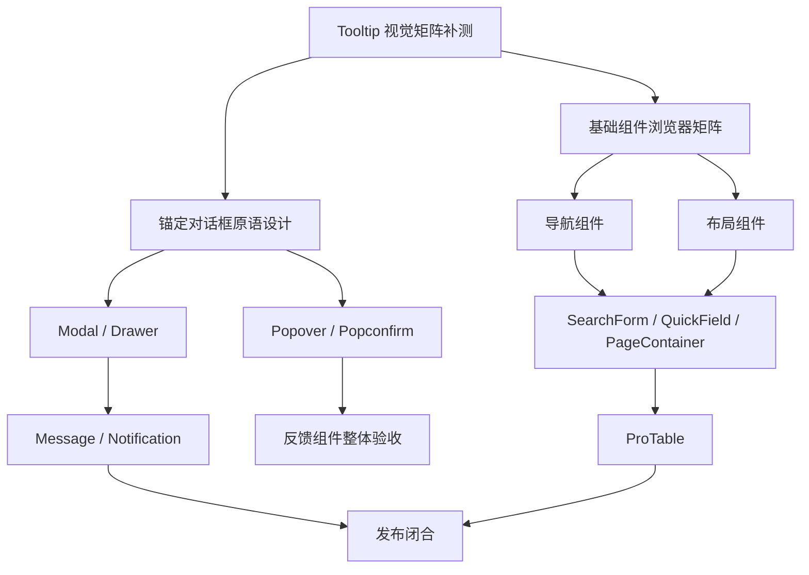

# lx-ui 后续实施总计划

更新时间：2026-10-03  
适用范围：React 18/19、Ant Design 5、PC 中后台组件库  
维护人：主代理负责架构、边界、验收和交付；子代理负责在明确边界内实现与复审

这份文档是 Tooltip 之后的执行计划。它把已经存在的代码、尚未完成的浏览器证据和待实现模块排成有依赖关系的批次。每个批次必须关闭自己的问题后才能进入下一批；“代码已经存在”不等于“组件已经交付”。

## 一、当前基线

### 已完成的能力

- 主题运行时：`LxConfigProvider`、light/dark/system、comfortable/compact、business/soft/glass、6 个标准主题色和 7 组东方配色。
- General：Button、Icon、Typography、Space、Divider。
- Form：Input、InputNumber、Select、DatePicker、Checkbox、Switch、Radio、Upload、FormItem、DynamicForm。
- Data Display：Pagination、Table、Tree、Empty、Skeleton、Result、Tag、Badge、Descriptions、Avatar、Statistic、Card、List。
- Feedback：Alert、Spin、Progress、Tooltip。
- 文档体系：Dumi 组件页、独立 demo、API 表、行为边界、中文注释、项目规则和 Impeccable 审计记录。
- 工程出口：主入口、`lx-ui/antd`、`lx-ui/business`、`lx-ui/theme` 和 CSS 入口；AntD 5 作为 peer dependency。

### 当前未闭合项

1. 已实现组件的完整浏览器矩阵还未全部完成。Tooltip 已验证默认桌面、360px 窄屏、ARIA 合并/恢复、受控触发和边缘自动调整；暗色、compact、约 930px、320px、200%/400% 缩放、reduced-motion、屏幕阅读器、全 12 方位和 React 19 消费 smoke 仍需补证据。
2. Popover 和 Popconfirm 暂不实现。它们需要先有可访问的锚定对话框原语，不能把 Tooltip 的 `role="tooltip"` 语义扩展到可操作内容。
3. Modal、Drawer、Message、Notification 尚未实现。
4. Breadcrumb、Steps、Tabs、Dropdown/Menu 尚未实现。
5. Layout、Flex、Grid 尚未实现。
6. SearchForm、QuickField、PageContainer、ProTable 尚未实现。
7. React 19、UMD、直引脚本、私库发布和独立包体报告尚未闭合。

## 二、依赖关系和批次顺序

执行顺序固定为：

1. 2B-1 Tooltip 浏览器验收收口。
2. 2B-2 锚定对话框原语设计与最小实现。
3. 2B-3 Popover、Popconfirm、Modal、Drawer、Message、Notification。
4. 3A 导航基础组件。
5. 4A 布局基础组件。
6. 5A 业务组合组件。
7. 5B ProTable。
8. 6A React 18/19、SSR、UMD、包体和发布闭合。

## 三、详细执行批次

### 批次 2B-1：现有组件浏览器验收收口

目标是把已实现组件从“静态代码 GO”推进到“有范围说明的浏览器交付”。不新增组件 API。

工作项：

- 建立浏览器矩阵表：默认桌面、930px、390px、320px、200% 缩放、light/dark、comfortable/compact、business/soft/glass、代表性标准色和东方配色。
- 为每个组件选择最小状态路径：默认、hover、focus、disabled、loading、empty、error、恢复、长文本和 portal 容器。
- 优先处理 Tooltip、Input、DynamicForm、Table、Upload、Alert、Spin、Progress；其余组件按 Data Display、Form、General 顺序抽查。
- 记录真实视口、操作、DOM/AX 结果、控制台、截图和未覆盖范围；浏览器工具受限时保留真实限制。
- 检查实际包体和 demo 是否被错误打入 npm 产物。

关闭条件：

- 每个已公开组件都有一条可追溯的浏览器证据或明确的未验收记录。
- 不把 `detect` 的 `[]`、单元测试或源码阅读写成视觉通过。
- P0/P1 关闭；P2 要么修复，要么写入后续计划并说明影响。

### 批次 2B-2：可访问的锚定对话框原语

这是 Popover/Popconfirm 的前置架构批次，先评审协议再写组件。

必须先锁定：

- 公开 DOM 契约：锚点、浮层根、`role`、`aria-expanded`、`aria-controls`、`aria-describedby` 的职责边界。
- 焦点进入、焦点恢复、Tab 循环、Escape 关闭、外部点击、失焦策略和嵌套浮层规则。
- 非模态锚定面与模态 dialog 的差异，禁止用 `role="tooltip"` 冒充交互对话框。
- SSR/hydration、StrictMode、多实例、portal 容器、滚动裁切、边缘定位和异步内容生命周期。
- AntD 公共 API 与自有原语的责任边界；禁止查询 AntD 私有 DOM，禁止运行时改写原生角色。

关闭条件：

- ADR、TypeScript 类型、键盘行为测试、SSR 测试、焦点恢复测试和定位 demo 通过独立复审。
- 在原语未关闭前，Popover/Popconfirm 不进入 scaffold 白名单和主包出口。

### 批次 2B-3：反馈组件完善

实施顺序：Modal → Drawer → Popover → Popconfirm → Message → Notification。

每个组件必须明确：

- 受控和非受控状态，打开/关闭回调，卸载时是否保留内容。
- loading、失败、异步确认、重复提交、关闭阻止和错误恢复。
- 焦点陷阱或焦点恢复规则，Esc、遮罩点击和浏览器返回键是否由宿主处理。
- portal、z-index、多个 Provider、嵌套弹层和窄屏布局。
- 不把请求、权限、路由、全局消息队列和业务缓存写入基础组件。

关闭条件：组件目录契约、中文注释、公开类型、可运行 demo、行为测试、SSR/StrictMode 测试、浏览器交互证据、构建和包体检查全部通过。

### 批次 3A：导航组件

实施顺序：Breadcrumb → Steps → Tabs → Dropdown/Menu。

协议重点：

- 路由只由宿主通过 `href`、链接组件或回调注入；组件不读取路由和 URL。
- Tabs 的受控 key、默认 key、键盘箭头/Home/End、删除和溢出策略。
- Menu 的层级 key、展开状态、点击外部、Escape、方向键和长标题。
- Dropdown 只负责锚定和菜单呈现，菜单项动作由宿主提供。

### 批次 4A：布局组件

实施顺序：Flex/Grid → Layout。

协议重点：

- Flex/Grid 消费主题间距和断点 token，不创建第二套栅格系统。
- Layout 的 Header/Sider/Content/Footer 只管理结构；权限、路由、菜单数据由宿主传入。
- Sider 折叠状态受控，移动端断点和 SSR 初始布局必须明确。
- 验收覆盖 320px、200%/400% 缩放、长标题、sticky、滚动容器和焦点可见。

### 批次 5A：业务组合组件

实施顺序：SearchForm → QuickField → PageContainer。

- SearchForm 将草稿值和已提交查询值分开，IME 回车、重置、异步失败和 URL adapter 由公开协议描述。
- QuickField 将展示、编辑、保存中、成功、失败、重试和取消建模为状态机，不内置请求。
- PageContainer 只提供标题、面包屑、操作区和内容槽，不拥有权限、路由或页面请求。
- 每个组合组件必须基于已完成的基础组件，禁止重新实现 Input、FormItem、Button 等视觉控件。

### 批次 5B：ProTable

在 SearchForm、Pagination、Table、Layout 稳定后实现。

必须先锁定：

- `dataSource` 与 `request` 的互斥关系。
- AbortSignal/requestId 取消旧请求，旧响应不能覆盖新查询。
- 总数变化时的页码修正、跨页选择策略、列配置持久化由宿主注入。
- 筛选、排序、分页、批量操作、失败重试、空状态和权限占位。
- 虚拟化为显式能力，不默认打开；固定列和横向滚动必须有真实浏览器证据。

### 批次 6A：发布闭合

- React 18 和 React 19 消费 smoke，至少覆盖主入口、`lx-ui/antd`、`lx-ui/theme`、CSS 入口和业务入口。
- SSR renderToString/hydration、StrictMode、按需引入和重复依赖检查。
- ESM/CJS 类型声明、UMD 外置 peer、standalone 直引版本和 gzip/unpacked 包体报告。
- `npm pack --dry-run` 确认不含 demos、tests、Dumi 临时文件和 UI 设计输入。
- 私库 registry、版本、CHANGELOG、迁移说明和发布前 `private` 状态评审。

## 四、每批固定执行模板

### 开始前

1. 读取 `AGENTS.md`、`docs/project-rules.md`、`docs/impeccable-workflow.md`、本批设计稿和相邻组件。
2. 列出公开 API、状态机、键盘/读屏语义、依赖和包体预算。
3. 更新本文件对应任务状态；没有设计证据的状态先记为待决策。

### 实现中

1. 主代理先锁协议，`gpt-6.1-sol` medium 子代理实现机械代码。
2. 所有注释和 JSDoc 使用中文；组件目录必须有 `index.tsx`、`index.module.css`、`index.md`、`types.ts` 和测试。
3. 每个 demo 必须可运行，展示样式、使用方法、Props、事件、ref、边界和恢复路径。
4. 运行 Impeccable context、audit、critique、polish；`detect []` 只作机械记录。

### 交付前

1. `gpt-6.1-sol` xhigh 独立 code review 和 UX review。
2. P0/P1/P2 修复后再次使用 xhigh 复审；模型服务失败要记录，不能虚构结论。
3. 自动格式化本批文件，再运行 scaffold、format、typecheck、demo typecheck、lint、test、lib build、docs build 和包体检查。
4. 主代理检查 diff、审计记录、未覆盖范围和公开出口。
5. 提交 Conventional Commit 并普通 push；禁止强推和混入无关改动。

## 五、风险与决策闸门

| 风险               | 触发条件                           | 处理方式                                   |
| ------------------ | ---------------------------------- | ------------------------------------------ |
| 视觉稿只有静态画面 | 缺少焦点、错误、窄屏或动效状态     | 先补设计评审和状态表，不自行扩展公开 API   |
| AntD 公共 API 不足 | 需要查询私有 DOM 或 rc-* 实例      | 停止实现，建立自有原语或调整范围           |
| 包体增长           | 新依赖、整包图标、重复 AntD        | 先做体积对比和替代方案评估                 |
| 受控状态歧义       | open/value 与 default 同时变化     | 写优先级、测试动态切换，并优先禁止隐式切换 |
| 浏览器能力受限     | 无法设置视口或读取屏幕阅读器       | 记录真实限制，不把静态证据写成视觉通过     |
| 业务边界膨胀       | 组件开始处理请求、权限、路由、缓存 | 抽成宿主 adapter 或 business 组合组件      |

## 六、当前下一步

下一批默认从 **2B-1 Tooltip 与既有组件浏览器矩阵补测** 开始。矩阵完成后进入 **2B-2 锚定对话框原语评审**，评审关闭前不实现 Popover/Popconfirm。若浏览器工具持续不能覆盖完整矩阵，先完成可验证范围并在审计记录中保留缺口，再继续原语架构文档工作。
